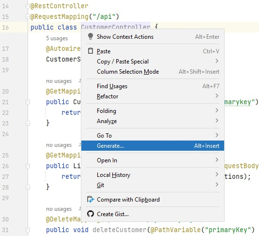
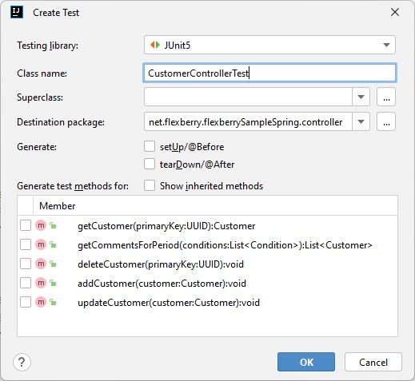
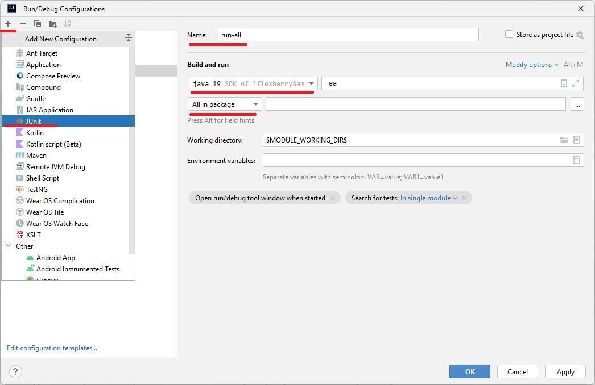

## Создание интеграционных тестов для контроллеров в Spring

При создании приложения в Spring в нём уже есть всё необходимое для написания тестов.

### Основные сущности используемые при написании тестов

* `@SpringBootTest` - аннотация для класса с тестами, будет найдет класс с аннотацией `@SpringBootApplication` и использован в качестве контекста приложения при запуске тестов.
* `@Test` - аннотация для метода, помечающая его как тест.
* `AssertJ` - библиотека утверждений для проверки результатов в тестах.
* `TestRestTemplate` - класс с удобным функционалом для тестирования `REST API`.
* `@Autowired` - аннотация для внедрения зависимостей.

### Самый простой способ создать тест

Чтобы создать класс с тестами для какого-нибудь контроллера, в контекстном меню, вызванном для этого класса, выберите пункт `Generate...`, затем `Test...`.



В открывшемся диалоговом окне выберите методы, для которых будут сразу созданы тесты, задайте дополнительные параметры, и нажмите `OK`.



### Пример теста

```java
package net.flexberry.flexberrySampleSpring.controller;

import net.flexberry.flexberrySampleSpring.model.Customer;
import net.flexberry.flexberrySampleSpring.repository.CustomerRepository;

import org.junit.jupiter.api.Test;
import org.springframework.beans.factory.annotation.Autowired;
import org.springframework.boot.test.context.SpringBootTest;
import org.springframework.boot.test.web.client.TestRestTemplate;
import org.springframework.boot.test.web.server.LocalServerPort;
import org.springframework.http.*;

import static org.assertj.core.api.Assertions.assertThat;

@SpringBootTest(webEnvironment = SpringBootTest.WebEnvironment.RANDOM_PORT)
class CustomerControllerTest {
    /**
     * В аннотации для класса указан параметр, при котором приложение будет запускатся на случайном порту.
     * В это свойство будет записан порт, на котором запущенно приложение.
     */
    @LocalServerPort
    private int port;

    /**
     * Web-клиент который будет отправлять запросы к тестируемому приложению.
     */
    @Autowired
    private TestRestTemplate restTemplate;

    /**
     * Класс-репозиторий для взаимодействия с базой через Spring Data.
     */
    @Autowired
    CustomerRepository repository;

    @Test
    void updateCustomer() {
        // Arrange. Создаём в базе объект который будем изменять.
        var customer = new Customer();
        customer.setName("New Customer");
        customer.setAge(1);

        Customer savedCustomer = repository.save(customer);

        Integer customerAge = 99;
        String customerName = "Old Customer";

        savedCustomer.setAge(customerAge);
        savedCustomer.setName(customerName);

        // Act. Отправляем запрос на изменение объекта, и проверяем что он завершился успешно.
        assertThat(
            restTemplate.exchange(
            "http://localhost:" + port + "/api/customers",
                HttpMethod.PUT,
                new HttpEntity<Customer>(savedCustomer),
                String.class
            ).getStatusCode()
        ).isEqualTo(HttpStatus.OK);

        // Assert. находим в базе объект который изменяли, и проверяем результат.
        Customer updatedCustomer = repository.findById(savedCustomer.getPrimarykey()).orElse(new Customer());

        assertThat(updatedCustomer.getAge()).isEqualTo(customerAge);
        assertThat(updatedCustomer.getName()).isEqualTo(customerName);
    }
}
```

### Запуск тестов

Для классов и методов помеченных соответствующими аннотациями, `IntelliJ IDEA` показывает кнопки для быстрого запуска набора тестов.

Чтобы добавить отдельную конфигурацию для запуска всех тестов, в меню `Run` выберите пункт `Edit configurations...`.
В открывшемся диалоге нажмите `+`, выберите `JUnit`, задайте необходимые параметры, и нажмите `OK`.



### Полезные ссылки

* https://spring.io/guides/gs/testing-web/
* https://assertj.github.io/doc/
* https://www.baeldung.com/spring-boot-testresttemplate
* https://www.baeldung.com/spring-webclient-resttemplate
